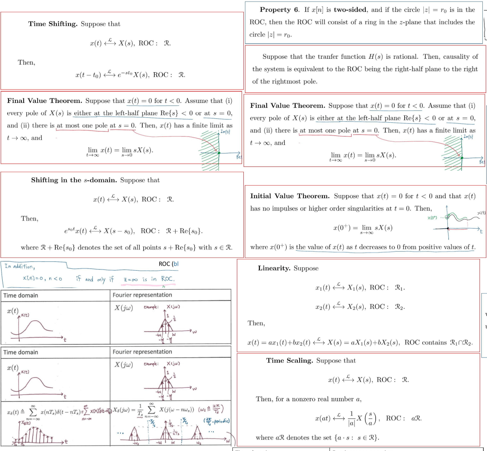

# LazyNotes

## Description:
LazyNotes utilizes opencv, packer, and other tools to create note sheets
for you. By filling a directory called "slides" with images, boxed notes will
be transferred onto a blank A4 page.

## Example Output:

## Usage:
1) place images to be processed in a directory named "slides" in the same directory
  as main.py
2) create an empty directory called "extracted"
3) run main.py

## Options
--verify - Allows the user to select which images to put onto their notesheet
