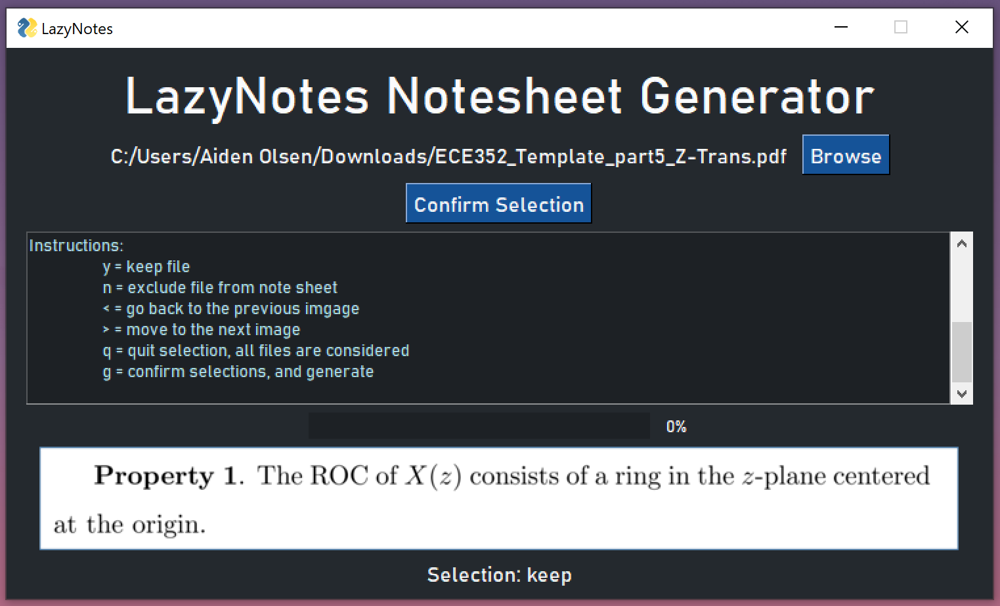

# LazyNotes

## Description:
LazyNotes utilizes opencv, packer, and other tools to create note sheets
for you. By selecting a .pdf files, notes in rectangular or square boxes
will be packed tightly onto an A4 page. The user can select which boxes to include and exclude as well.

## Example Output:
